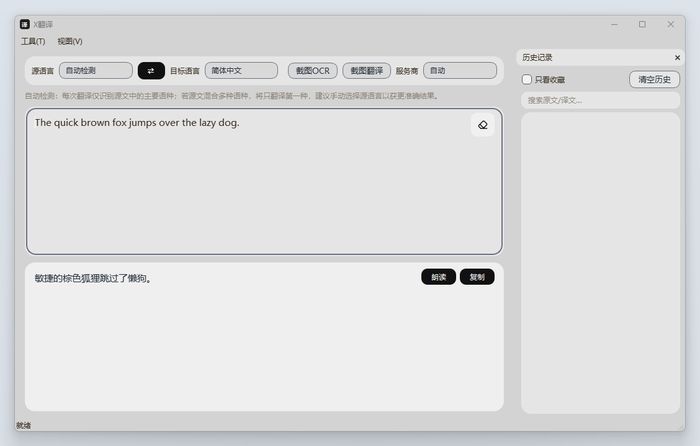
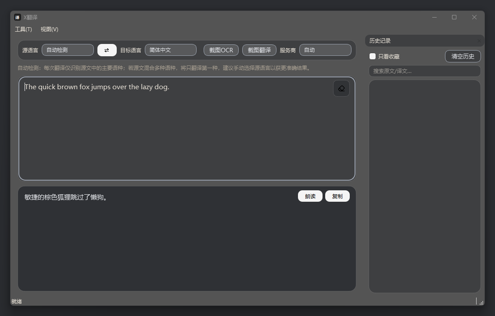
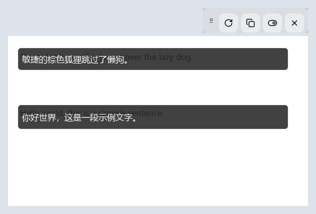
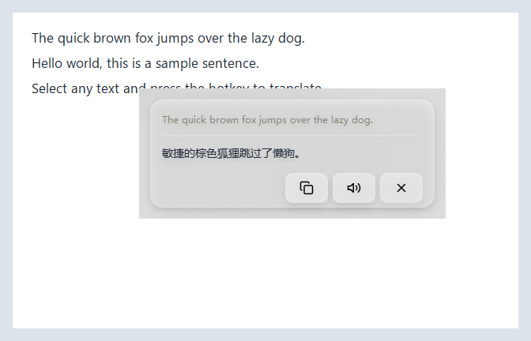
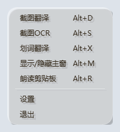
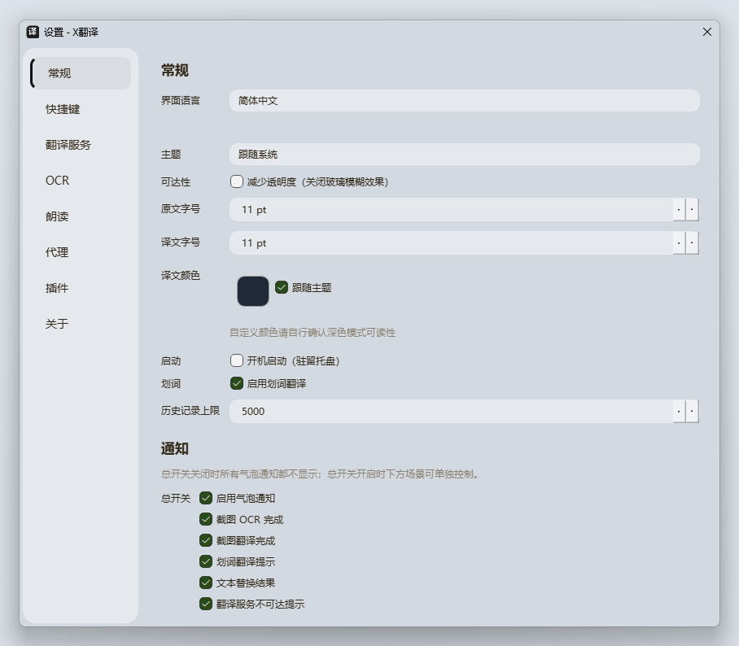

# X翻译 (XTranslate)

[](LICENSE)
[](https://www.qt.io/)
[](https://onnxruntime.ai/)
[](https://opencv.org/)

屏幕翻译工具，支持截图 OCR、截图翻译、划词翻译、文本替换、朗读剪贴板、插件扩展等能力，驻留系统托盘，热键全局触发。




## 功能特性

- **截图翻译**：拖选屏幕区域 → OCR 识别 → 译文覆盖层（可拖动、可锁定穿透）
- **截图 OCR**：拖选屏幕区域 → OCR → 结果对话框（含坐标、置信度）
- **划词翻译**：选中文本 → 弹出译文卡片
- **文本替换**：选中文本 → 翻译 → 就地替换原文
- **朗读剪贴板**：TTS 朗读剪贴板内容（v0.7.2 新增云端 Edge 神经嗓音，默认引擎，全语种无需本机语音包；失败自动回退系统嗓音）
- **插件扩展**：进程外翻译插件（plugin.exe / plugin.py / plugin.bat）
- **Liquid Glass UI**：Windows 11 亚克力毛玻璃效果，浅色/深色/跟随系统主题
- **多语言界面**：中文（默认）/ English
- **Per-Monitor v2 DPI**：多显示器不同缩放比例下清晰渲染




## 快捷键

| 快捷键 | 功能 | 说明 |
|--------|------|------|
| `Alt+D` | 截图翻译 | 拖选区域 → OCR → 译文覆盖层 |
| `Alt+S` | 截图 OCR | 拖选区域 → OCR → 结果对话框 |
| `Alt+X` | 划词翻译 | 选中文本 → 弹出译文卡片 |
| `Alt+T` | 文本替换 | 选中文本 → 翻译 → 就地替换 |
| `Alt+M` | 显示/隐藏主窗 | 切换主窗口可见性 |
| `Alt+R` | 朗读剪贴板 | 需有可用语音引擎 |

所有快捷键均可在 **设置 → 快捷键** 中自定义。




## 安装

### 方式一：安装包（推荐）

1. 从 [Releases](../../releases) 下载 `XTranslate-Setup-0.7.2.exe`
2. 运行安装程序（中文向导）
3. 启动后驻留系统托盘

### 方式二：从源码构建

#### 前置依赖

- **Visual Studio 2022**（含 C++ 桌面开发 workload）
- **CMake 3.21+**
- **Qt 6.8.3**（MSVC 2022 x64，含以下模块：Core, Gui, Widgets, Network, Sql, Svg, Multimedia, TextToSpeech, Concurrent, WebSockets）
- **OpenCV 4.10**（静态精简构建：core + imgproc）
- **ONNX Runtime 1.27**（Windows x64 预构建）
- **Inno Setup 6**（仅打包安装包时需要）

将第三方库放置于 `third_party/` 目录：

```
third_party/
  Qt/6.8.3/msvc2022_64/         # Qt 安装目录
  opencv-install/                # OpenCV 静态构建安装目录
  onnxruntime/                   # ONNX Runtime 预构建（含 lib/include）
```

#### 构建步骤

```powershell
# 1. 克隆仓库
git clone https://github.com/3058319692qq-byte/Xtranslate.git
cd Xtranslate

# 2. 下载 OCR 模型（必做！models/ 不随仓库分发）
powershell -ExecutionPolicy Bypass -File tools/fetch_models.ps1

# 3. 构建
powershell -ExecutionPolicy Bypass -File build.ps1 -Clean

# 4. 部署到 dist/（含 Qt 运行时 + 15 项 selftest）
powershell -ExecutionPolicy Bypass -File tools/deploy.ps1

# 5.（可选）打包安装包
powershell -ExecutionPolicy Bypass -File tools/pack_installer.ps1
```

> **注意**：`tools/fetch_models.ps1` 会从 [modelscope RapidAI/RapidOCR](https://modelscope.cn/models/RapidAI/RapidOCR) 下载官方 PP-OCRv6 small ONNX 模型（约 31MB，Apache-2.0），并做 SHA256 校验。跳过此步骤会导致 CMake 配置阶段 `FATAL_ERROR`。

## 翻译服务

内置 10 个翻译 provider，按优先级自动调度，失败自动降级：

| 服务 | 是否需密钥 | 说明 |
|------|-----------|------|
| Google | 否 | 免费网页接口 |
| Bing | 否 | 免费网页接口 |
| Lingva | 否 | 需实例地址 |
| DeepLX | 否 | 需实例地址 |
| Mock | 否 | 离线兜底，返回 `[MOCK] <text>` |
| DeepL | 是 | Auth Key |
| 百度翻译 | 是 | AppId + 密钥 |
| 有道智云 | 是 | 应用 ID + 密钥 |
| 腾讯云 TMT | 是 | SecretId + SecretKey |
| OpenAI 兼容 | 是 | baseUrl + API Key + 模型 |

在 **设置 → 翻译服务** 中配置密钥与优先级。

## 朗读（TTS）

- **云端（Edge，默认）**：Edge 浏览器"大声朗读"同源神经嗓音，全语种（中/英/日/韩/法/德/西/俄…）开箱即用，不依赖本机语音包；需联网，受代理设置影响。
- **系统嗓音**：本机 SAPI/WinRT 语音引擎，离线可用，需安装对应语言的语音包。
- 回退链：云端失败（断网/接口变更）自动回退系统嗓音；系统无对应语音包再回退默认嗓音，全程不崩溃不静默。
- 在 **设置 → 朗读** 中切换引擎、按语言选嗓音、测试朗读。

> **声明**：云端语音使用 Edge 非官方免费接口（与 Google/Bing 免费翻译同性质），仅供个人学习，接口可用性不作保证。

## OCR 引擎

- **本地 Paddle OCR**（默认）：内置 PP-OCRv6 small 检测 + 识别模型，支持行级坐标输出（用于截图翻译覆盖层）。开箱即用，精度高。
- **系统 OCR**：调用 Windows.Media.Ocr，不依赖 ONNX 模型，启动更快。需 Windows 10+ 与已安装 OCR 语言包。不暴露像素坐标，仅用于截图 OCR。

在 **设置 → OCR** 中切换，立即生效。

## 插件系统

插件目录：`%APPDATA%\XTranslate\plugins\`（或环境变量 `XTRANSLATE_PLUGINS_DIR`）

每个子目录视为一个插件，主入口文件名固定为 `plugin.exe` / `plugin.py` / `plugin.bat`（优先级 exe > py > bat）。通信协议为 JSON over stdio：

```
请求 {"op":"describe"}
  -> {"name":"<subdir>","version":"<x.y.z>"}

请求 {"op":"translate","text":"...","from":"...","to":"..."}
  -> {"text":"...","provider":"plugin:<name>"}
```

示例插件见 `examples/plugin-echo/`。

## 自助自测（selftest）

```powershell
# 单项测试
XTranslate.exe --selftest <mode>

# 批量回归（15 项全测）
powershell -File tools/run_selftest.ps1
```

支持模式：`env | ocr | translate | capture | overlay | hotkey | tts | selection | config | db | providers | theme | replace | systemocr | plugin`

每项输出一行 JSON 到 stdout，exit code 0 = pass。

## 文件结构

```
XTranslate/
  src/                          C++ 源码
  resources/                    QSS 主题 / SVG 图标 / i18n 翻译
  installer/                    Inno Setup 安装脚本
  models/                       OCR 模型（.gitignore 排除，用 fetch_models.ps1 下载）
  third_party/                  第三方库（.gitignore 排除）
  docs/                         README 截图
  examples/plugin-echo/         示例插件
  tools/                        构建/部署/测试脚本
  CMakeLists.txt
  build.ps1
  LICENSE                       MIT 许可证
  THIRD-PARTY-NOTICES.txt       第三方组件版权声明
  README.md                     本文件
  README.txt                    纯文本说明（安装目录兜底）
```

用户数据：

```
%APPDATA%\XTranslate\
  config.json                   配置
  history.db                    历史记录
  plugins\                      用户插件
```

卸载时保留个人配置与历史记录；如需彻底清除，请手动删除 `%APPDATA%\XTranslate`。

## 开源许可

本项目采用 [MIT 许可证](LICENSE)。

本软件包含以下开源组件，遵循其各自的许可证（详见 [THIRD-PARTY-NOTICES.txt](THIRD-PARTY-NOTICES.txt)）：

- [Qt 6](https://www.qt.io/) — GNU LGPL v3
- [OpenCV](https://opencv.org/) — Apache License 2.0
- [ONNX Runtime](https://onnxruntime.ai/) — MIT License
- [PaddleOCR PP-OCRv6](https://github.com/PaddlePaddle/PaddleOCR) — Apache License 2.0
- [Lucide Icons](https://lucide.dev/) — ISC License

## 免责声明

本软件为学习性复刻项目，仅供学习与技术交流使用，不用于任何商业用途。翻译结果由第三方服务提供，准确性以各服务商为准。在使用本软件的过程中，用户需自行承担风险。各翻译服务的商标与服务条款归各自所有者所有。
